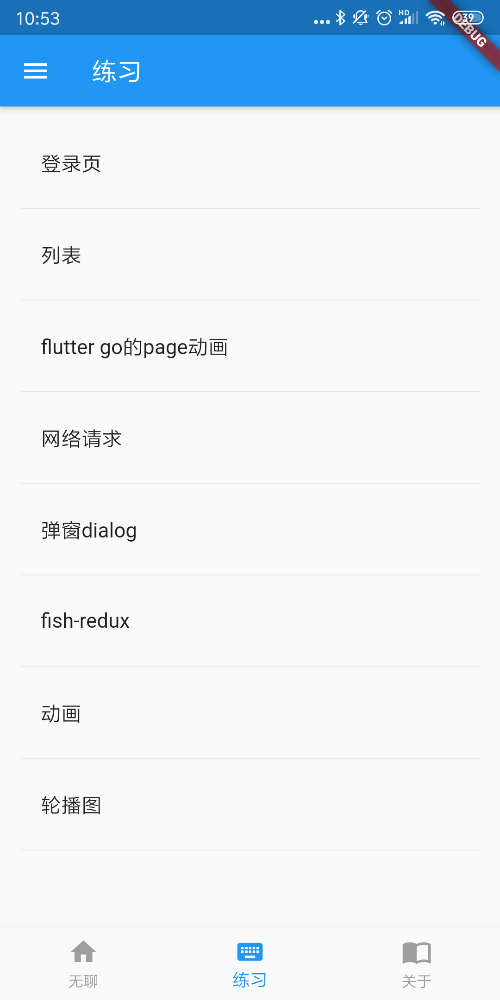
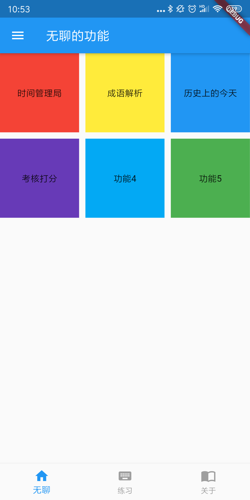
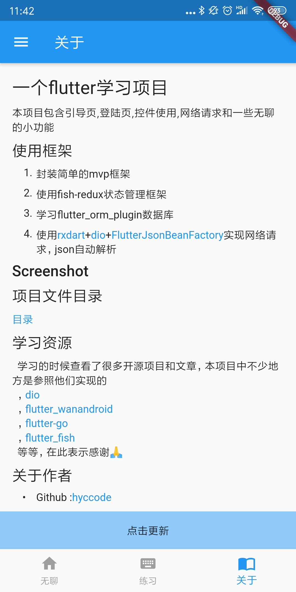
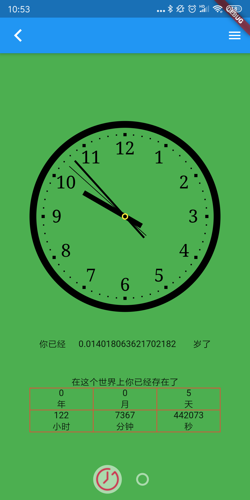
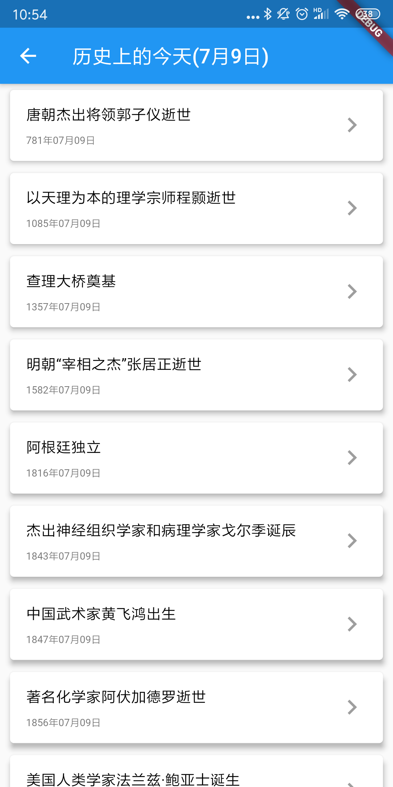
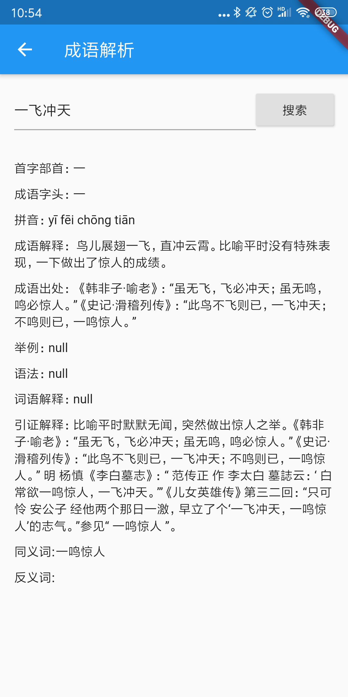

# 一个flutter学习项目
本项目包含引导页,登陆页,控件使用,网络请求和一些无聊的小功能

## 使用框架
  1. 封装简单的mvp框架
  2. 使用fish-redux状态管理框架
  3. 学习flutter_orm_plugin数据库
  4. 使用[rxdart](https://github.com/ReactiveX/rxdart)+[dio](https://github.com/flutterchina/dio)+[FlutterJsonBeanFactory](https://github.com/zhangruiyu/FlutterJsonBeanFactory)实现网络请求，json自动解析
 

## Screenshot
   
   1.   
 
   2.   

## apk体验
   安卓下载地址
   

   
   
## 项目文件目录
[目录](tree)

## 学习资源
  学习的时候查看了很多开源项目和文章，本项目中不少地方是参照他们实现的
  ，[dio](https://github.com/flutterchina/dio)
  ，[flutter_wanandroid](https://github.com/Sky24n/flutter_wanandroid)
  ，[flutter-go](https://github.com/alibaba/flutter-go)
  ，[flutter_fish](https://github.com/woaigmz/flutter_fish)
  等等，在此表示感谢🙏

## 关于作者
- Github :[hyccode](https://github.com/hyccode)
- 简书   :[hyccode](https://www.jianshu.com/u/05a596515104)
